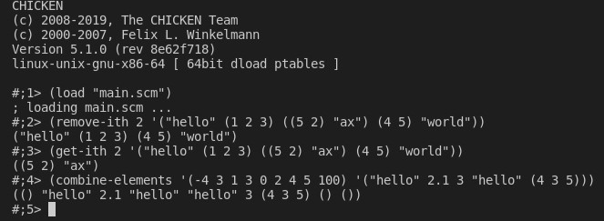

# Scheme List Funcs

This README.md file was generated on 2022-08-12 by Shion Mizuguchi.

This program contains three simple scheme functions that operates on lists. The program was an assignment from the summer 2022 independent study course ECE399 at The Cooper Union.
- The first function, "remove-ith" takes an integer, i, and a list, l. The list can contain elements of any type, including other lists. This function returns a new list that has all the items from the list l except the ith item, which has been removed. If index i is not valid (it is either negative or greater than the length of the list) the list l gets returned without modifications. 
- The second function, "get-ith" takes an integer i, and a list, l. The function returns the item at index i in list l. If the index i is invalid, an empty list gets returned.
- The third function, combine-elements, takes two lists, il and l. The first list, il, is a list of integer indexes, some which may be invalid or repeating. The second lsit, l, contains elements of any type. The function returns a new list formed by fetching the items of list l at the indexes from list il. If an index from list il is invalid, the item will be an empty list.

## CONTENTS OF THIS FILE
 
- Contained Files
- Compilation
- Author
- File Creation Date


## CONTAINED FILES

- main.scm
- tests.txt
- testImg.jpg


## EXAMPLE OUTPUT




## COMPILATION

- The Scheme interpreter used during the creation of main.scm is from [CHICKEN Scheme](https://wiki.call-cc.org/man/5/Getting%20started#chicken)
- Invoke the CHICKEN interpreter using the ```csi``` command in the terminal.
- Load this Scheme file using ```load main.scm```
- In the interpreter, call the functions. Examples are included in tests.txt. 


## AUTHOR

- Name: Shion Mizuguchi
- Email: shion.mizuguchi@cooper.edu
- Institution: The Cooper Union 


## FILE CREATION DATE 

2022-08-12
